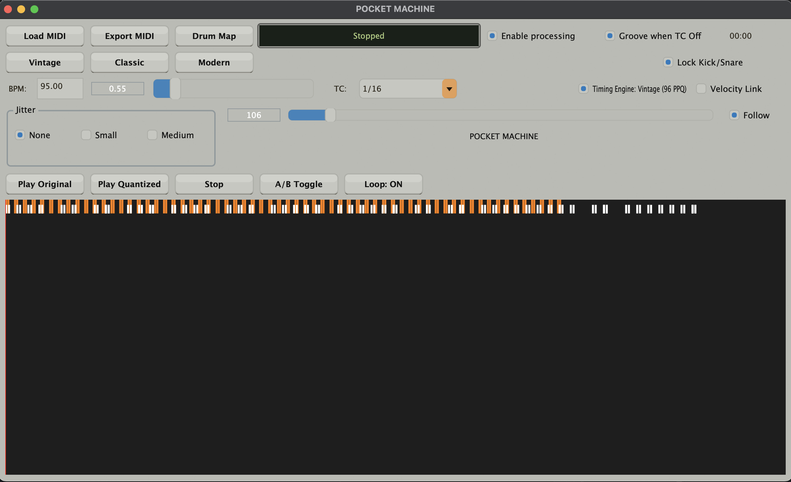
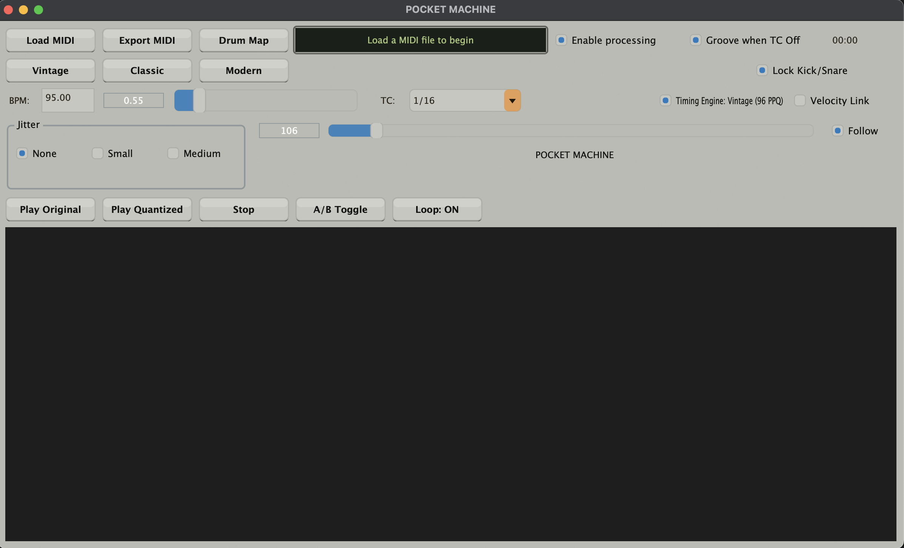

# Pocket Machine

Pocket Machine is a lightweight macOS standalone app for adding groove, swing, and human feel to MIDI drum patterns.

Import a MIDI drum loop, shape the timing with classic groove-style controls, then export the processed MIDI back into your DAW. It is built for producers who want rigid programmed drums to feel more alive without opening a full sequencing environment.

## Features

- Import MIDI drum patterns
- Apply timing shifts and swing
- Add groove inspired by classic drum machines and samplers
- Export processed MIDI for use in any DAW
- Standalone macOS app
- Simple workflow for quickly transforming programmed drums

## Download

Download the latest release from the repository:

[Download Pocket Machine](MPCQuantizerStandalone.zip)

After downloading, unzip the app and move it to your Applications folder.

## Usage

1. Open Pocket Machine.
2. Import a MIDI drum pattern.
3. Adjust the groove, swing, and timing feel.
4. Preview or refine the result.
5. Export the processed MIDI.
6. Drag the exported MIDI back into your DAW.

## Notes

Pocket Machine is intended for MIDI drum programming and groove experimentation. It does not generate audio; it modifies MIDI timing so you can use the result with your own drum instruments, samplers, or DAW plugins.

## System Requirements

- macOS 10.13 or later
